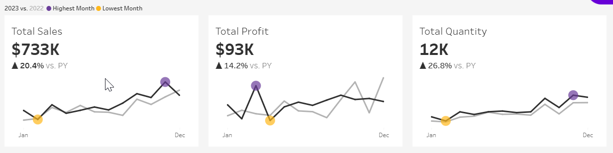

# 📊 Sales & Customer Performance Dashboard | Tableau  

## 📌 Project Overview  

This project focuses on developing two **interactive dashboards** in **Tableau**—a **Sales Dashboard** and a **Customer Dashboard**—to help **sales managers, executives, and marketing teams** analyze key business performance metrics. These dashboards provide insights into **sales trends, customer behavior, and profitability** to support data-driven decision-making.  

## 📂 Dataset

The dataset used in this project includes:

- **Sales Transactions** (Order date, revenue, profit, quantity sold)
- **Products Information** (Product name, product category, product subcategory)
- **Customers Details** (Customer name, location)

*Entity Relationship Diagram (ERD) that shows the relationship between each tables from the dataset.*

The dataset is a dataset about sales and customer data from a fictional company and it's part of [**Data with Baraa**](https://www.youtube.com/@DataWithBaraa) Tableau Course on Youtube.

## 📈 Sales Dashboard  

*Preview on the sales dashboard page*

### 🎯 Purpose  

The **Sales Dashboard** provides an overview of key **sales metrics and trends**, helping stakeholders analyze year-over-year performance and identify growth opportunities.  

### 🔑 Key Features  

#### 📌 KPI Overview - Sales Trends

- Displays **Total Sales, Profit, and Quantity Sold** for both **current and previous years**.  
- Monthly breakdown of **Sales, Profit, and Quantity Sold** for both **current and previous years**.  
- Highlights **highest and lowest sales months** for quick insights.  

*KPI sales*

#### 🏷️ Product Subcategory Comparison  

- Side-by-side comparison of **sales performance by product subcategory** for the current and previous years.  
- Includes a **sales vs. profit comparison** to assess profitability.  

*Product subcategory comparison using bar-in-bar bar chart and profit and loss bar chart for each product subcategory.*

#### 📆 Weekly Trends for Sales & Profit  

- Weekly visualization of **sales and profit** for the current year.  
- Displays **average weekly values** and highlights weeks that are **above or below average**.  

*Weekly sales and profit trends for the current year (2023) showing the average line for each charts and shown using step line chart.*

## 🛒 Customer Dashboard  

*Preview on the customer dashboard page*

### 🎯 Purpose  

The **Customer Dashboard** helps marketing teams and executives **analyze customer behavior, track purchasing trends, and identify high-value customers**.  

### 🔑 Key Features  

#### 📌 KPI Overview - Customer Trends

- Displays **Total Customers, Total Sales per Customer, and Total Orders** for both **current and previous years**.  
- Monthly breakdown of **customer metrics** for both **current and previous years**.  
- Identifies **highest and lowest sales months** for strategic planning.  

#### 📊 Customer Distribution by Number of Orders  

- Distribution analysis of customers based on **the number of orders placed**, providing insights into customer loyalty and engagement.  

*Customer distribution by the numbers of orders they placed for the current year.*

#### 🏆 Top 10 Customers By Profit  

- Ranks the **top 10 customers** who contributed the most profit.  
- Displays **rank, number of orders, total sales, total profit, and last order date**.  

*Table showing the data for the top 10 customers by profit they generated from every orders they ever placed.*

## 🎨 Dashboard Design & Interactivity  

### 🔄 Dynamic Features  

- Allows users to **select and analyze historical data** by choosing a specific year.

- Enables easy **navigation between dashboards**.  

- Interactive **filters and visual elements** allow users to drill down into data.  

### 🎛️ Data Filters  

Users can filter data by:  

- **🏷️ Product Details:** Category, Subcategory  
- **🌍 Location Details:** Region, State, City  

*Filter pane that is hidden from the main view and can be shown and hidden using a button on the dashboard to view the data based on one or multiple conditions.*

## 📌 Conclusion  

This **Tableau Sales & Customer Performance Dashboard** helps stakeholders **track performance, identify trends, and make data-driven decisions**. Future improvements may include:  

- **Real-time data integration** for live updates.

## 📬 Contact  

For any questions feel free to reach out via [my email](mailto:taufik.achmad.septian@gmail.com)
 or connect on [LinkedIn](https://www.linkedin.com/in/taufikachmads/).
